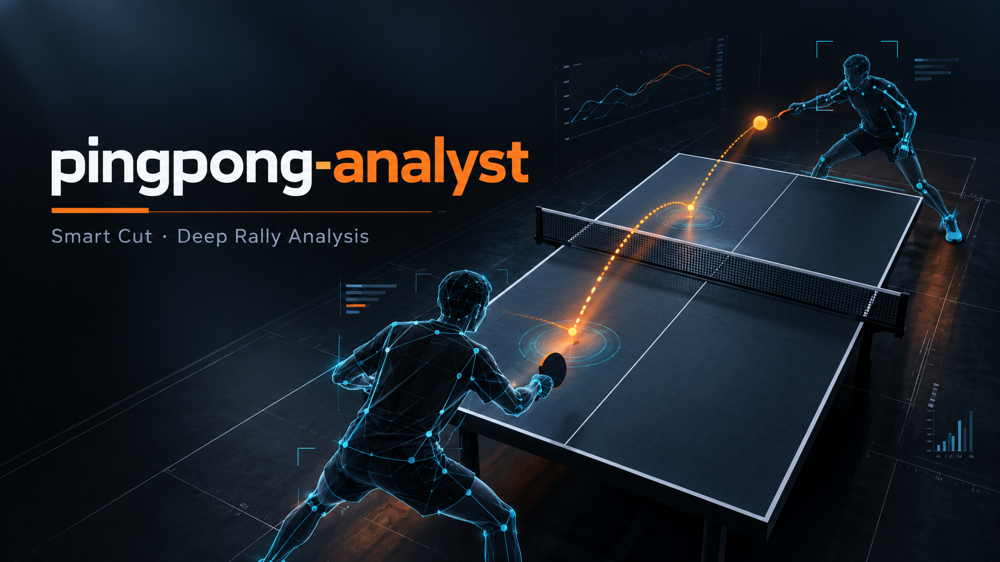

<p align="center">
  
</p>

<h1 align="center">PingPongVision</h1>

<p align="center">
  <strong>Table tennis video intelligence</strong> · 乒乓球视频智能分析<br/>
  Ball tracking · Rally cuts · Pose reports · Highlight edits<br/>
  球追踪 · 回合切分 · 动作报告 · 精彩成片
</p>

<p align="center">
  <a href="#english">English</a> ·
  <a href="#中文">中文</a> ·
  <a href="docs/local-and-server.md">Deployment / 部署说明</a>
</p>

<p align="center">
  
  
  
  
</p>

---

<a id="english"></a>

## What it is

**PingPongVision** is a local-first computer-vision stack for table tennis footage. Upload a session, calibrate the table once, then turn unstructured video into reviewable structure: board crossings, rally clips, pose-backed action metrics, and shareable highlight compositions.

| Layer | Capability |
| --- | --- |
| **Rally** | TrackNet / CV candidates → board crossing & landing → clip export |
| **Action** | YOLO-Pose + MediaPipe angles, identity association, hit enrichment |
| **Geometry** | Four-corner calibration for rectified table-space decisions |
| **Adaptation** | Manual ball labels → TrackNet fine-tune → versioned model registry |
| **Editorial** | Highlight project store + composition renderer |
| **Ops** | Auth, workbench, device auto-select (`auto` / MPS / CUDA / TensorRT) |

Rally and action pipelines are **isolated on purpose**: a rally job never loads pose models; an action job never emits rally clips. Memory stays predictable on Apple Silicon and on NVIDIA T4.

Product tone: **clinical dashboard**, not demo theatre. Warm orange for the ball path, cool cyan for telemetry, dark chrome for the operator UI.

> **Privacy.** This repository publishes **source and docs only**. Videos, SQLite state, signing secrets, weights, and exports remain on your machine (see `.gitignore`).

---

## Architecture

```text
Video library (data/)
        │
        ▼
   FastAPI + Static UI  ── WebSocket live overlay
        │
   ┌────┴─────────────────────────────┐
   │                                  │
 Rally pipeline                  Action pipeline
 TrackNet / CV                   YOLO-Pose + MediaPipe
 board crossing / landing        angles & identity
 clip export                     action report
   │                                  │
   └──────────┬───────────────────────┘
              ▼
     Highlight editor → composition render
```

Runtime knobs live in [`config.yaml`](config.yaml). Artifacts land under `data/`, `output/`, `logs/`, and `models/runs/` — none are required to clone.

Python package module name remains `pingpong_analyst` for import stability:

```bash
python -m pingpong_analyst.api --host 127.0.0.1 --port 8077
```

---

## Requirements

| Environment | Notes |
| --- | --- |
| **Python** | 3.11+ (developed on 3.12) |
| **macOS** | Apple Silicon → PyTorch **MPS**; otherwise CPU |
| **Linux + NVIDIA** | CUDA 12.x + optional **TensorRT 8.6+** |
| **FFmpeg** | On `PATH` for stream-copy clips / composition |

Weights are **not** vendored. Place them relative to the project root:

```text
models/yolo11s-pose.pt
models/TrackNet_best.pt
```

Without TrackNet weights, rally analysis falls back to a **CV path** for development — not production accuracy. Download pointers and TensorRT tensor shapes: [docs/local-and-server.md](docs/local-and-server.md).

---

## Quick start

```bash
git clone https://github.com/zhaopeinan/PingPongVision.git
cd PingPongVision

python -m venv .venv
source .venv/bin/activate   # Windows: .venv\Scripts\activate

python -m pip install -U pip
python -m pip install -r requirements-mac.txt

# Recommended before real footage:
# place YOLO + TrackNet weights under models/

python -m pingpong_analyst.api --host 127.0.0.1 --port 8077
```

Open **http://127.0.0.1:8077**.

| Bootstrap account | Value |
| --- | --- |
| Username | `admin` |
| Password | `admin123` |

Rotate this password in the workbench **before** binding beyond localhost.

```bash
curl -s http://127.0.0.1:8077/api/health
PYTEST_DISABLE_PLUGIN_AUTOLOAD=1 pytest -q
```

---

## Server (CUDA / TensorRT)

```bash
python -m pip install -r requirements-server.txt
# Match CUDA / TensorRT to the host; install tensorrt wheels accordingly.

# TrackNet engine shape must match config:
#   [1, 27, 288, 512] → [1, 8, 288, 512]

# Edit APP_DIR / CONDA_ENV in start.sh, then:
bash start.sh start
bash start.sh status
```

Default bind: `0.0.0.0:8077`. Treat it as an **authenticated internal service**, not a public anonymous upload endpoint.

---

## Operator workflow

1. Sign in → video library → upload / select footage  
2. Calibrate table (fixed camera): corners TL → TR → BR → BL  
3. Rally track → board events + clips  
4. Action analyze (full video or a clip) → pose / angle report  
5. Annotate & adapt TrackNet when venue lighting breaks the base model; **select** the saved version explicitly  
6. Highlight editor → compose → export  

---

## Configuration & security

- Device / model thresholds: `config.yaml`
- JWT material: `data/.token_secret` (auto-generated, never commit)
- Do not publish `data/`, `output/`, weight archives, or production databases

---

## Layout

```text
pingpong_analyst/     Application package (API, core, models, UI)
config.yaml           Runtime configuration
requirements-*.txt    Dependency sets (macOS / server)
start.sh              GPU host process helper
docs/                 Specs, plans, deployment notes
tests/                Pytest suite
```

---

<a id="中文"></a>

## 这是什么

**PingPongVision** 是一套本地优先的乒乓球视频计算机视觉系统。上传训练 / 比赛素材，完成一次球台标定后，即可把非结构化视频变成可复盘的结构：过板事件、回合剪辑、姿态驱动的动作指标，以及可分享的精彩成片。

| 层级 | 能力 |
| --- | --- |
| **回合** | TrackNet / 纯 CV 候选 → 过板与落点 → 剪辑导出 |
| **动作** | YOLO-Pose + MediaPipe 关节角、身份关联、击球增强 |
| **几何** | 四角标定，决策可进入台面坐标系 |
| **适配** | 人工标球 → TrackNet 微调 → 版本化模型注册表 |
| **成片** | 精彩工程存储 + 合成渲染 |
| **运维** | 账号、工作台、设备自动选择（`auto` / MPS / CUDA / TensorRT） |

回合与动作管线**刻意隔离**：回合任务不加载姿态模型，动作任务不产出回合剪辑，便于在 Apple Silicon 与 NVIDIA T4 上控制显存。

产品调性是**临床仪表盘**：画面是主角，指标是配角；暖橙强调球迹，冷青服务遥测。

> **隐私。** 本仓库只发布**源码与文档**。视频、数据库、签名密钥、权重与导出文件均保留在本机（见 `.gitignore`）。

---

## 架构

```text
视频库 (data/)
      │
      ▼
 FastAPI + 静态前端 ── WebSocket 实时叠层
      │
 ┌────┴──────────────────────────┐
 │                               │
 回合管线                         动作管线
 TrackNet / CV                    YOLO-Pose + MediaPipe
 过板 / 落点                       角度与身份
 剪辑导出                         动作报告
 │                               │
 └──────────┬────────────────────┘
            ▼
     精彩编辑器 → 成片渲染
```

配置见 [`config.yaml`](config.yaml)。Python 包名仍为 `pingpong_analyst`（保证 import 稳定）：

```bash
python -m pingpong_analyst.api --host 127.0.0.1 --port 8077
```

---

## 环境要求

| 环境 | 说明 |
| --- | --- |
| **Python** | 3.11+（开发环境 3.12） |
| **macOS** | Apple Silicon → **MPS**；否则 CPU |
| **Linux + NVIDIA** | CUDA 12.x，可选 **TensorRT 8.6+** |
| **FFmpeg** | 需在 `PATH` 中 |

**权重不入库**，请自行放置：

```text
models/yolo11s-pose.pt
models/TrackNet_best.pt
```

缺少 TrackNet 时走**纯 CV 回退**（适合联调，不等于正式精度）。详见 [docs/local-and-server.md](docs/local-and-server.md)。

---

## 快速开始

```bash
git clone https://github.com/zhaopeinan/PingPongVision.git
cd PingPongVision

python -m venv .venv
source .venv/bin/activate

python -m pip install -U pip
python -m pip install -r requirements-mac.txt

python -m pingpong_analyst.api --host 127.0.0.1 --port 8077
```

浏览器打开 **http://127.0.0.1:8077**。

| 首次管理员 | 值 |
| --- | --- |
| 用户名 | `admin` |
| 密码 | `admin123` |

**请立刻在工作台改密**；不要把默认口令暴露到公网。

```bash
curl -s http://127.0.0.1:8077/api/health
PYTEST_DISABLE_PLUGIN_AUTOLOAD=1 pytest -q
```

---

## 服务器（CUDA / TensorRT）

```bash
python -m pip install -r requirements-server.txt

# TrackNet engine 形状需与 config 一致：
#   [1, 27, 288, 512] → [1, 8, 288, 512]

# 修改 start.sh 中 APP_DIR / CONDA_ENV 后：
bash start.sh start
bash start.sh status
```

默认监听 `0.0.0.0:8077`，按**内网已认证服务**对待。

---

## 推荐操作流

1. 登录 → 视频库上传 / 选择素材  
2. 球台标定（固定机位）：左上 → 右上 → 右下 → 左下  
3. 回合追踪 → 过板事件与剪辑  
4. 动作分析（整段或某一剪辑）→ 姿态 / 角度报告  
5. 标球微调 TrackNet，保存后在下拉框中**显式选择**版本  
6. 精彩编辑器编排并导出成片  

---

## 配置与安全

- 设备与模型阈值：`config.yaml`  
- JWT 密钥：`data/.token_secret`（自动生成，禁止提交）  
- 勿公开 `data/`、`output/`、权重压缩包或生产库  

---

## 目录

```text
pingpong_analyst/     应用包（API、核心算法、模型、前端）
config.yaml           运行配置
requirements-*.txt    依赖清单
start.sh              GPU 主机进程脚本
docs/                 设计与部署文档
tests/                测试
```

---

<p align="center">
  <sub>PingPongVision — from footage to reviewable structure.</sub>
</p>
